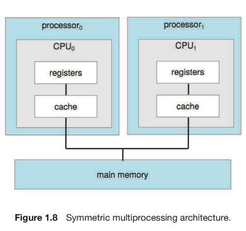
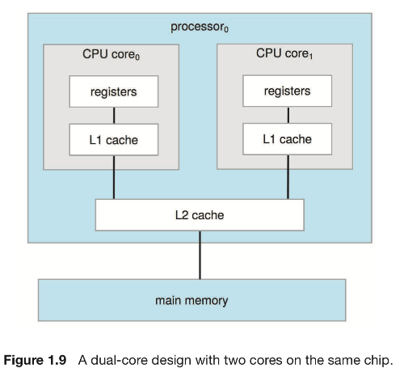
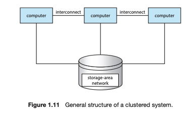
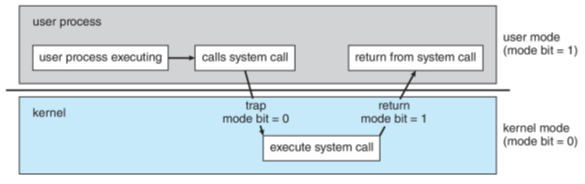

# 컴퓨터 시스템 및 이중 모드

## 1. 컴퓨터 시스템

### 컴퓨터 시스템 구성요소의 정의

- CPU : 명령을 실행하는 하드웨어
- 프로세서(Processor) : 하나 이상의 CPU를 포함하는 물리적 칩
- 코어(Core) : CPU의 기본 계산 단위
- 다중 처리기(Multiprocessor) : 여러 프로세서를 포함함
- 다중 코어(Multicore) : 동일한 CPU에 여러 컴퓨팅 코어를 포함함

### 단일 처리기 시스템(Single-Processor Systems)

- 하나의 처리기(보통 하나의 CPU, 하나의 코어)
- 현대 컴퓨터 시스템에는 거의 없음

### 다중 처리기 시스템(Multi-Processor Systems)

- 각각 단일 코어 CPU가 있는 두 개 이상의 프로세서
- 시스템 버스에 대한 경합, 공유 자원에 대한 경합 등으로 프로세서의 수와 성능이 정비례하지는 않음

### 다중 코어 시스템(Multi-Core Systems)

- 하나의 처리기 내 여러 개의 코어
- 칩 내 통신이 칩 간 통신보다 빨라서 단일 코어를 갖는 여러 칩보다 단일 칩내 여러 코어가 더 효율적
- N개의 코어를 가지는 다중 코어 프로세서는 마치 N개의 CPU처럼 보임

### 클러스터형 시스템(Clustered Systems)

- 둘 이상의 독자적 시스템 또는 노드들을 연결하여 구성(다중 처리기 시스템과의 차이)
- 둘 이상의 호스트들이 응용 프로그램을 실행하고 서로 감시하는 대칭형 클러스터링과 다른 컴퓨터들이 응용 프로그램을 실행하는 동안 한 컴퓨터는 긴급 대기(Hot-standby) 모드 상태를 유지하는 비대칭형 클러스터링이 있음

### 다중 태스킹(Multi-tasking)

- CPU가 여러 프로세스를 전환하며 프로세스를 실행하지만 전환이 자주 발생하여 사용자에게 빠른 응답 시간을 제공하는 시스템
- CPU에 비하면 I/O 작업은 너무 느려서 CPU가 I/O 작업 완료를 기다리지 않고 일을 하게 함

## 2. 이중 모드

- 운영체제와 사용자는 컴퓨터 시스템의 하드웨어 및 소프트웨어 자원을 공유하기 때문에 시스템을 올바르게 실행하려면 잘못되거나 악의적인 프로그램으로 인한 문제를 막아야한다. 이를 운영체제를 위해 실행되는 작업과 사용자를 위해 실행되는 작업으로 구분하고 전자를 커널 모드(0), 후자를 사용자 모드(1)로 구분하는 것을 이중 모드라고 한다.
- 이중 모드는 모드 비트(Mode bit)를 통해 현재 모드를 구분할 수 있고 트랩이나 인터럽트 발생 시 또는 복귀 시 전환됨

## 3. 타이머

- 지정된 지간 후 컴퓨터를 인터럽트 하도록 설정할 수 있는 하드웨어로 운영체제가 CPU에 대한 제어를 유지할 수 있게 해줌
- 일단 CPU가 사용자에게 넘어가면 컴퓨터의 제어권이 넘어간거라 무한 루프등의 로직이 있으면 타이머가 없을 때 답이 없음
