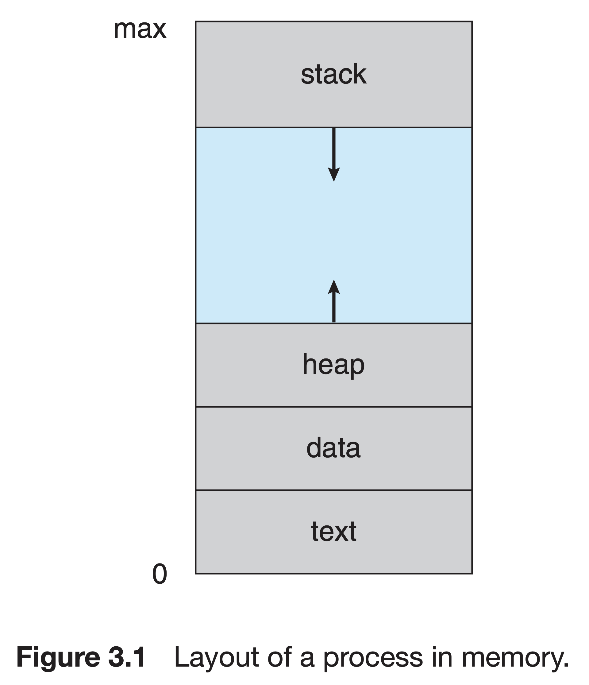
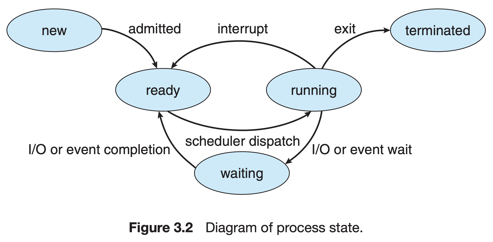
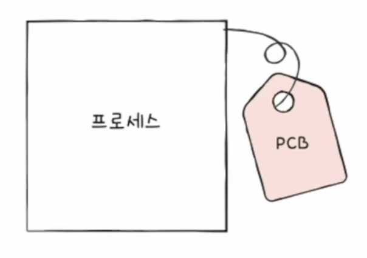
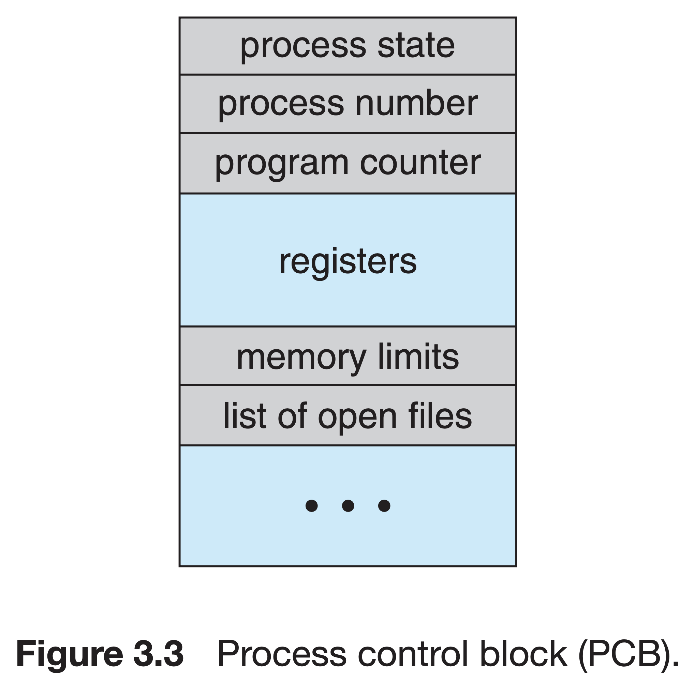
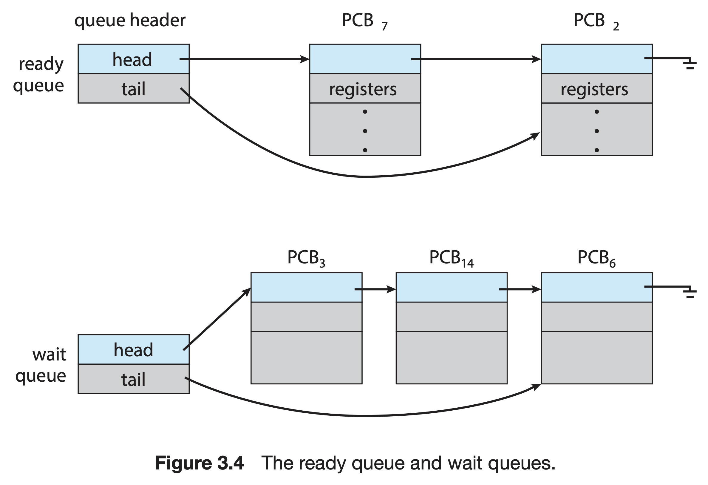
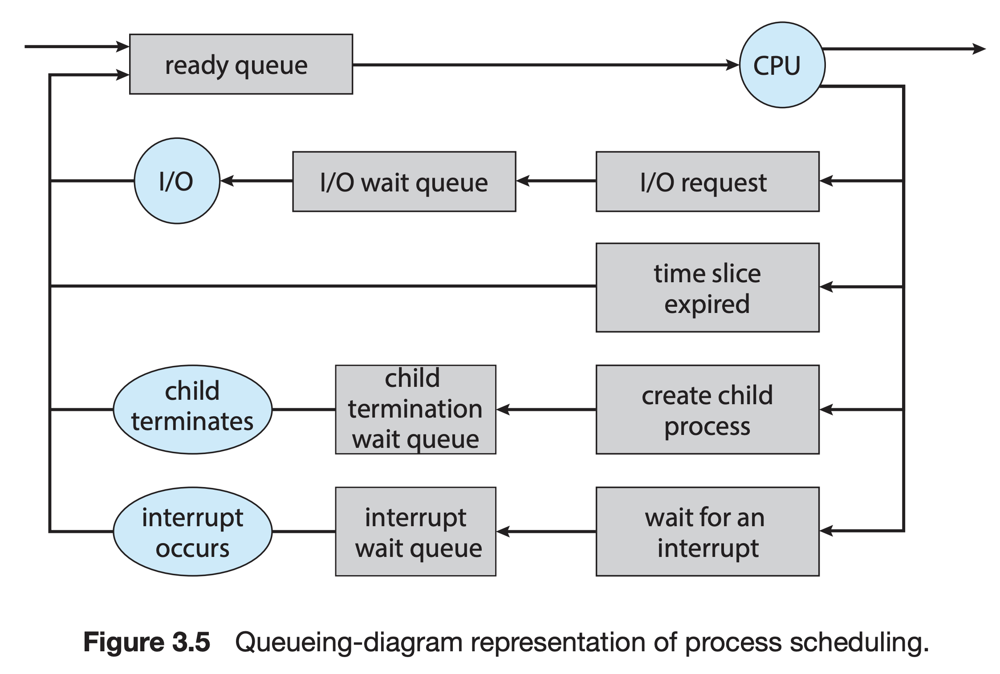
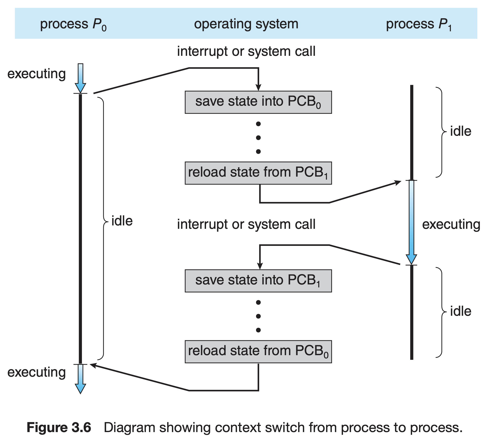

# 프로세스

# 3.1 프로세스 개념

## 3.1.1 프로세스

### 프로그램과 프로세스

- **프로그램**

    **→ 명령어 리스트를 내용으로 가진 디스크에 저장된 파일**

- **프로세스**

    **→ 메모리에 적재되어 실행 중인 프로그램**

### 프로세스 메모리 배치

- **텍스트 섹션, 코드 섹션(Text section, Code section)**

    **→ 실행할 수 있는 코드, 기계어로 이루어진 명령어**

    **→ read-only**

    **→ 크기 고정**

- **데이터 섹션(Data section)**

    **→ 전역 변수**

    **→ 크기 고정**

- **BSS 섹션(Block Stared by Symbol section)**

    **→ 전역 변수(초기값 없음)**

- **힙 섹션(Heap section)**

    **→ 프로그램 실행 중에 동적으로 할당되는 메모리**

    **→ 일반적으로 낮은 주소에서 높은 주소로 할당**

- **스택 섹션(Stack section)**

    **→ 데이터가 일시적으로 저장되는 공간(ex 함수 매개변수, 복귀 주소 및 지역 변수)**

    **→ 일반적으로 높은 주소에서 낮은 주소로 할당**

## 3.1.2 프로세스 상태

- **생성(New)**

    **→ 프로세스가 생성 중인 상태**

- **준비(Ready)**

    **→ 프로세스가 처리기에 할당되기를 기다리는 상태**

- **실행(Running)**

    **→ 명령어들이 실행 중인 상태**

    **→ 인터럽트 발생 시 준비 상태로, I/O 이벤트 등 발생 시 대기 상태로 전환**

- **대기(Wating)**

    **→ 프로세스가 어떤 이벤트(I/O 완료 or 신호 수신)가 일어나기를 기다리는 상태**

- **종료(Terminated)**

    **→ 프로세스의 실행이 종료된 상태**

## 3.1.3 프로세스 제어 블록

**프로세스 제어 블록(Process Control Block, PCB)은 프로세스 관련 정보를 포함하는 OS 커널의 자료 구조로 프로세스 생성 시 커널 영역에 생성, 종료 시 폐기**

### PCB에 포함된 정보

- **프로세스 ID(PID)**

    **→ 특정 프로세스를 식별하기 위해 부여하는 고유 번호**

- **프로세스 상태**

    **→ 생성(New), 준비(Ready), 실행(Running), 대기(Wating), 정지(Halted) 등**

- **프로그램 카운터**

    **→ 프로세스가 다음에 실행할 명령어의 주소**

- **CPU 레지스터들**

    **→ 프로세스가 다시 스케줄 될 때 계속 올바르게 실행되도록 하기 위해서 인터럽트 발생 시 저장되야함**

- **CPU 스케줄링 정보**

    **→ 프로세스 우선순위, 스케줄링 큐에 대한 포인터와 다른 스케줄링 파라미터를 포함**

- **메모리 관리 정보**

    **→ OS에 의해 사용되는 메모리 시스템에 따라 기준 레지스터(base register)와 한계 레지스터(limit register)의 값, OS가 사용하는 메모리 시스템에 따라 페이지 테이블 또는 세그먼트 테이블 등과 같은 정보를 포함**

- **I/O 상태 정보**

    **→ 이 프로세스에 할당된 I/O 장치들과 열린 파일의 목록 등을 포함**

- **회계 정보**

    **→ CPU 사용 시간과 경과된 실시간, 시간 제한, 계정 번호, 잡 또는 프로세스 번호 등을 포함**

# 3.2 프로세스 스케줄링

- **CPU-bound 프로세스**

    **→ 계산에 많은 시간을 사용하고 I/O 요청은 자주 생성하지 않는 프로세스**

- **I/O-bound 프로세스**

    **→ 계산에 소비하는 것보다 I/O에 더 많은 시간을 소비하는 프로세스**

## 3.2.1 스케줄링 큐

## 3.2.3 문맥 교환

> **문맥 교환(Context Switch)은 이전 프로세스의 문맥을 저장하고 새로운 프로세스의 문맥을 복구하는 과정**  
> **문맥은 프로그램 카운터, 각종 레지스터 값, 메모리 정보, 열었던 파일 정보, 사용한 I/O 장치 등 실행을 재개하기 위한 중간 정보(= PCB)**

# 3.3 프로세스에 대한 연산(UNIX)

## 3.3.1 프로세스 생성

### Fork-exec

> **fork() 시스템 콜로 기존 프로세스(부모 프로세스)의 복사본(자식 프로세스)을 만들고 exec() 시스템 콜로 새 프로그램으로 메모리 공간을 교체**

## 3.3.2 프로세스 종료

### wait

> **wait() 시스템 콜로 부모 프로세스는 자식 프로세스가 실행되는 동안 실행을 일시 중단할 수 있음**

### exit

> **exit() 시스템 콜로 종료되며 부모 프로세스에 상태 값을 반환할 수 있음**

### 좀비 프로세스(Zombie Process)

> **프로세스가 종료되면 자원은 OS에 반환되는데 프로세스의 종료 상태가 저장되는 프로세스 테이블의 해당 항목은 부모 프로세스가 wait()을 호출하기 전까지 남아 있게 되는데, 종료되었지만 부모 프로세스가 아직 wait()을 호출하지 않아 프로세스 테이블에 남아있는 프로세스를 좀비 프로세스라고 함**

### 고아 프로세스(Orphan Process)

> **고아 프로세스는 부모 프로세스가 wait()을 호출하지 않고 종료되었을 경우 생기며 고아 프로세스는 새로운 부모 프로세스를 루트 프로세스로 지정함으로써 문제 해결(루트 프로세스가 주기적으로 wait()을 호출)**

# Ref

### Operation System Concepts 10th EDITION

### [유튜브 - 개발자 강민철 [운영체제]](https://www.youtube.com/watch?v=isj4sZhoxjk)

### [Wikipedia - Fork-exec](https://en.wikipedia.org/wiki/Fork%E2%80%93exec)
