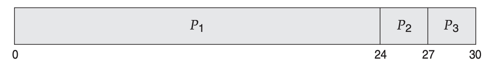
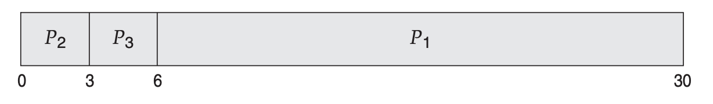
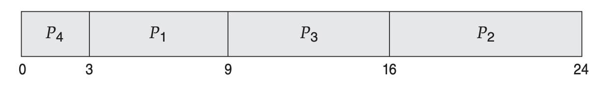
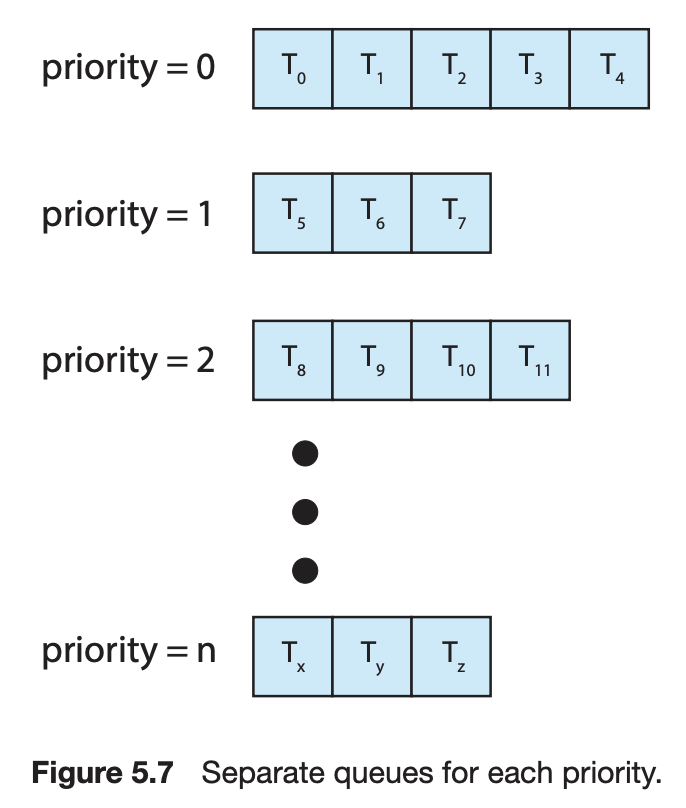
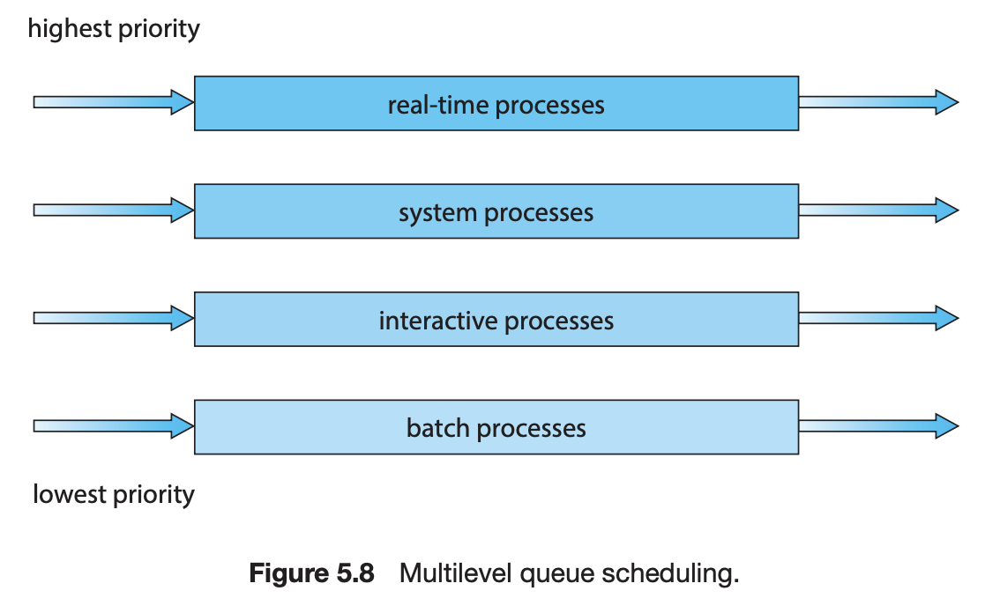
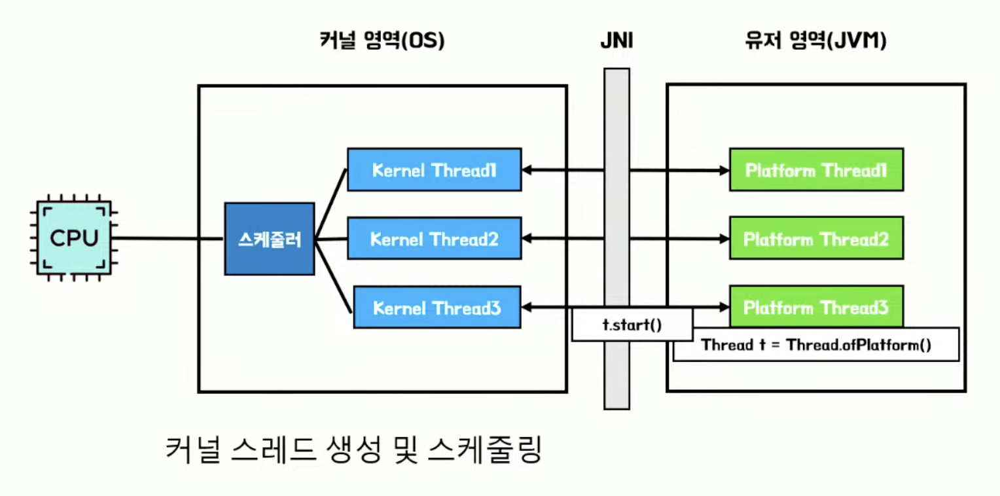
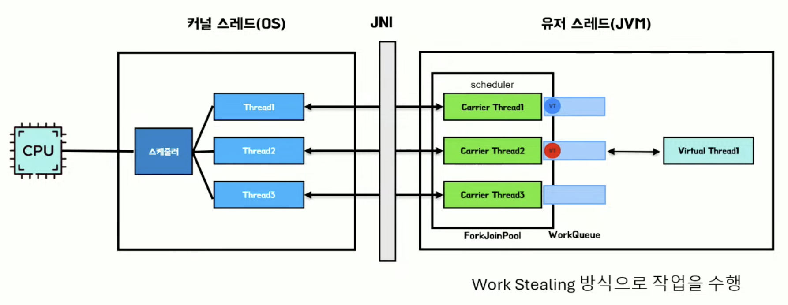

# 스케줄링 알고리즘

- CPU 스케줄링은 준비 큐에 있는 어느 프로세스에 CPU 코어를 할당할 것인지를 결정하는 문제
- 비선점형 스케줄링(Non-preemptive Scheduling)은 실행 상태인 프로세스가 종료 상태가 되거나 대기 상태로 전환될 때까지 CPU를 점유하는 스케줄링 방식
- 선점형 스케줄링(Preemptive Scheduling)은 실행 상태인 프로세스에게서 CPU를 뺏어올 수 있는 스케줄링 방식
- 아래 알고리즘들은 하나의 CPU 코어가 존재하는 상황으로 가정

### 1. 선입 선처리 스케줄링(FCFS Scheduling, First-Come, First-Served Scheduling)

- 비선점형 스케줄링 알고리즘
- CPU를 먼저 요청하는 프로세스가 CPU를 먼저 할당 받음(선입선출(FIFO) 큐로 관리)
- 평균 대기 시간이 길어질 수 있음
- 실행 시간이 긴 프로세스가 먼저 도착하여 실행되는 동안 실행 시간이 짧은 프로세스들이 불필요하게 대기하게 되는 호위 효과(Convoy Effect) 발생

|Process|Burst Time|
|-|-|
|P1|24|
|P2|3|
|P3|3|

P1, P2, P3 순서로 도착한 경우 P1의 대기 시간은 0, P2의 대기 시간은 24, P3의 대기 시간은 27로 평균 대기 시간은 (0 + 24 + 27) / 3 = 17

P2, P3, P1 순서로 도착한 경우 P2의 대기 시간은 0, P3의 대기 시간은 3, P1의 대기 시간은 6로 평균 대기 시간은 (0 + 3 + 6) / 3 = 3

### 2. 최단 작업 우선 스케줄링(SJF Scheduling, Shortest-Job-First Scheduling)

- 비선점형 스케줄링 알고리즘
- 가장 작은 Burst Time을 가진 프로세스에 CPU를 할당(동일하면 FCFS 적용)

|Process|Burst Time|
|-|-|
|P1|6|
|P2|8|
|P3|7|
|P4|3|

- 평균 대기 시간이 최소가 됨
- Burst Time을 알 수가 없다는 문제가 있는데 근사값을 통한 예측으로 추정함

### 3. 최소 잔여 시간 우선 스케줄링(SRT Scheduling, Shortest Remaining Time First Scheduling)

- 선점형 SJF 스케줄링
- 준비 큐에 새로운 프로세스가 도착했을 때 최단 작업을 계산 및 스케줄링

### 4. 라운드 로빈 스케줄링(RR Scheduling, Round-Robin Scheduling)

- 선점형 스케줄링 알고리즘
- FCFS + 타임 슬라이스라고하는 작은 단위 시간의 조합으로 선입 선처리를 하되 타임 슬라이스를 넘어가면 선점 발생
- 준비 큐에 N개의 프로세스가 있고 타임 슬라이스가 q일때 각 프로세스는 (N-1) * q 시간 이상을 기다리지 않음
- 타임 슬라이스가 크면 FCFS와 유사하게 동작하게 되고 타임 슬라이스가 작으면 문맥 교환 비용이 증가

### 5. 우선순위 스케줄링(Priority Scheduling)

- 우선순위에 기반해 스케줄링하는 방식으로 SJF는 우선순위 스케줄링에서 우선순위가 Burst Time의 역인 단순한 경우
- 선점형 스케줄링, 비선점형 스케줄링 모두 가능
- 우선순위가 낮은 프로세스가 CPU 할당을 무한히 기다리는 기아 현상(Starvation) 발생 가능 -> 에이징(Aging)으로 오래 대기하는 프로세스의 우선순위를 점차 증가시켜 해결 가능 또는 RR을 적용

### 6. 다단계 큐 스케줄링(Multilevel Queue Scheduling)

- 우선순위 별로 큐를 두는 방식
- 큐 내, 큐 간 각각 스케줄링 알고리즘 적용
- 프로세스의 큐 간 이동은 불가능

### 7. 다단계 피드백 큐 스케줄링(Multilevel Feedback Queue Scheduling)

- 프로세스의 큐 간 이동 가능한 다단계 큐 스케줄링(상위 큐 이동으로 에이징 적용)

---

# 스레드 라이브러리 in Java

- Java에서는 [Thread](https://docs.oracle.com/en/java/javase/21/docs/api/java.base/java/lang/Thread.html) 라이브러리가 있으며 스레드 생성 시 OS의 커널 스레드와 1:1로 매핑되는 플랫폼 스레드(= 유저 스레드)를 생성하고 `start()` 호출 시 JNI를 통해 매핑

- JDK 21부터는 가상 스레드(Virtual Thread)를 지원하는데 가상 스레드는 가상 스레드 생성 시 JVM의 캐리어 스레드와 1:N으로 매핑되는 가상 스레드를 생성하고 이 캐리어 스레드는 OS의 커널 스레드와 1:1로 매핑되어 있음

가상 스레드의 특징

- 스레드 생성 및 스케줄링 비용이 기존 스레드보다 저렴
- 기존 스레드는 커널 스레드와 1:1 매핑되는 구조여서 개수의 한계가 있고 Thread per Request 모델에서 Blocking I/O 발생 시 처리량의 비효율이 있었는데, 가상 스레드는 수십 수백만개 이상 생성할 수 있고 스레드 스케줄링을 통해 Nonblocking I/O 지원(웹서버의 처리량은 늘어도 DB Connecion 부하 주의)
- 기존 스레드는 OS가 스케줄링을 했는데 가상 스레드는 JVM이 스케줄링
- 기존 스레드를 상속하여 코드 호환

# Ref

- [[4월 우아한테크세미나] ‘Java의 미래, Virtual Thread’](https://www.youtube.com/watch?v=BZMZIM-n4C0)
- [JDK 21의 신기능 Virtual Thread 알아보기 (안정수 James)](https://www.youtube.com/watch?v=vQP6Rs-ywlQ)
