# Java에서의 동기화

## 0. 스레드 상태(Thread State)

스레드의 `getState()` 메서드로 스레드 상태(`enum`) 조회 가능

- `NEW`
  - 스레드가 생성되었으나 아직 시작되지 않은 상태
- `RUNNABLE`
  - 스레드가 실행 중이거나 실행될 준비가 된 상태
- `BLOCKED`
  - 스레드가 동기화 락을 기다리는 상태
- `WAITING`
  - 스레드가 무기한으로 다른 스레드의 작업을 기다리는 상태
- `TIMED_WAITING`
  - 스레드가 일정 시간 동안 다른 스레드의 작업을 기다리는 상태
- `TERMINATED`
  - 스레드가 실행이 완료된 상태

---

## 1. 메모리 가시성(Memory Visibility)

1. `runFlag`가 `true`인 동안 무한 루프를 도는 작업을 `MyTask`로 만들고 이 작업을 수행하는 `work 스레드` 실행
2. 1초 뒤 `main 스레드`에서 `MyTask`의 `runFlag`를 `false`로 변경
3. `runFlag`가 `false`로 바뀌면 `work 스레드`가 종료되길 기대하며 실행

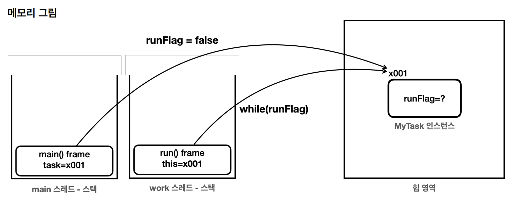

```java
public class VolatileFlagMain {

    public static void main(String[] args) {
        MyTask task = new MyTask();
        Thread t = new Thread(task, "work");
        log("runFlag = " + task.runFlag);
        t.start();

        sleep(1000);
        log("runFlag를 false로 변경 시도");
        task.runFlag = false;
        log("runFlag = " + task.runFlag);
        log("main 종료");
    }

    static class MyTask implements Runnable {

        boolean runFlag = true;

        @Override
        public void run() {
            log("task 시작");
            while (runFlag) {
                // runFlag가 false로 변하면 탈출
            }
            log("task 종료");
        }
    }
}
```

아래는 실행 결과인데 `runFlag`가 `false`임에도 JVM이 종료되지 않고 이는 유저 스레드인 `work 스레드`가 종료되지 않아서임

`main 스레드`에서 힙 영역의 `MyTask 인스턴스`의 필드를 변경한 것이고 이 `MyTask 인스턴스`를 `work 스레드`에서 참조 중이라 이상한 상황

```
10:12:24.457 [     main] runFlag = true
10:12:24.458 [     work] task 시작
10:12:25.464 [     main] runFlag를 false로 변경 시도
10:12:25.464 [     main] runFlag = false
10:12:25.464 [     main] main 종료

JVM 종료 안됨
```

### 예상 시나리오

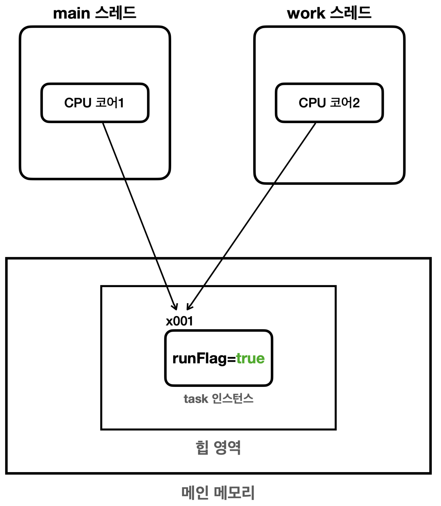
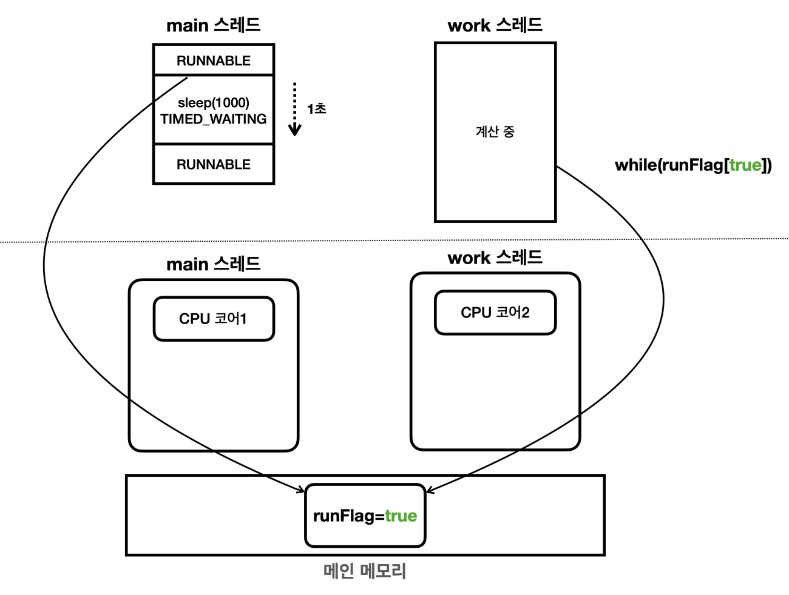
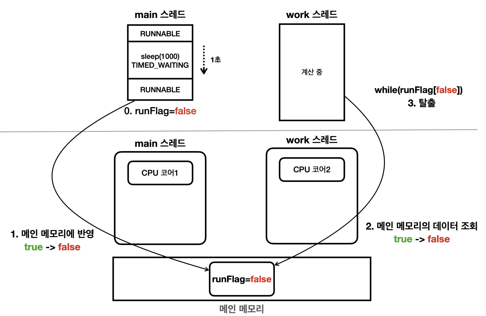

### 실제 시나리오

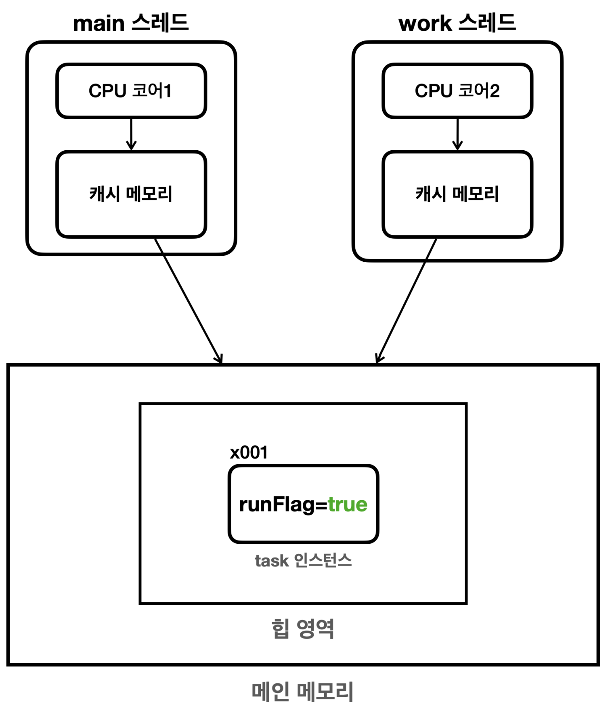
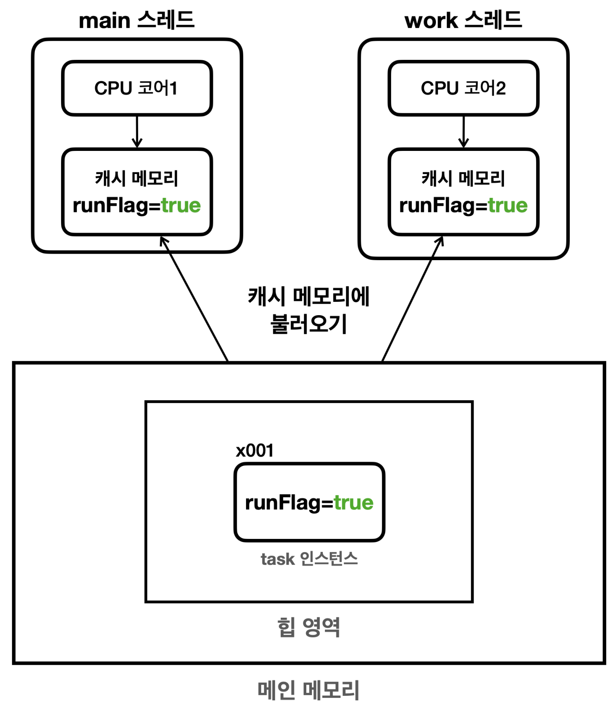
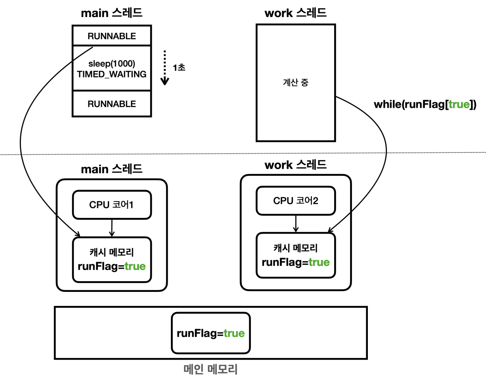
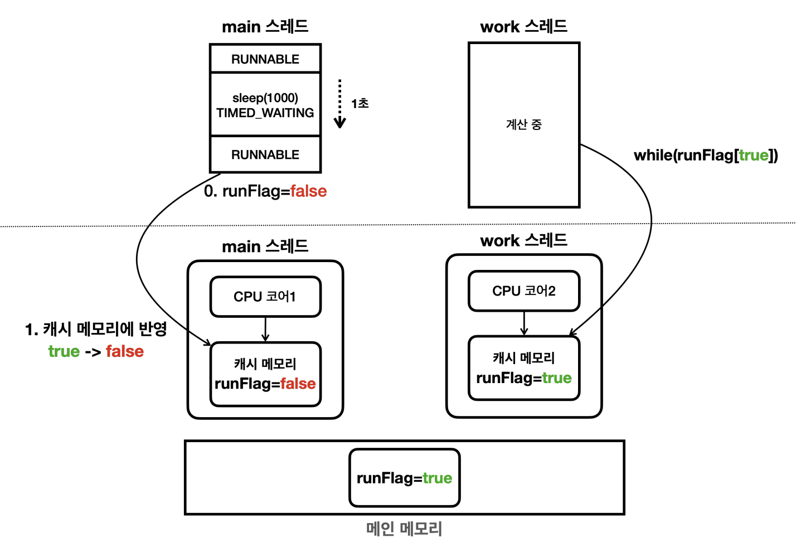
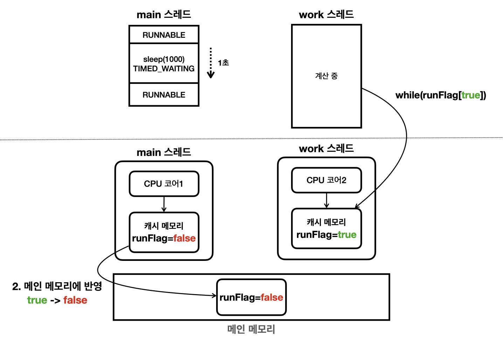

`main 스레드`가 실행되는 CPU 코어의 캐시 메모리의 값이 언제 메인 메모리에 반영될지는 알 수 없음

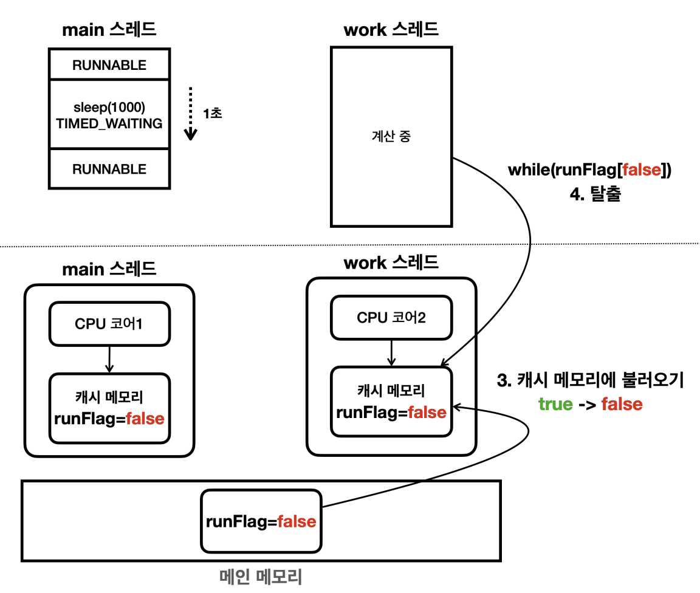

메인 메모리의 값이 `work 스레드`가 실행되는 CPU 코어의 캐시 메모리에 언제 반영될지도 알 수 없음

### `volatile`

이처럼 멀티스레드 환경에서 한 스레드가 변경한 값이 다른 스레드에 언제 보이는지에 대한 문제가 메모리 가시성 문제

CPU 코어 별로 독립적인 캐시 메모리를 사용해서 발생하는 문제이므로 캐시 메모리를 사용하지 않고 메인 메모리에서 값을 읽고 쓰면 간단하게 해결할 수 있는데 Java에서는 `volatile` 키워드를 통해 이런 기능을 제공(성능을 주고 정확성 향상)

`volatile` 또는 동기화 기법(`synchronized`, `ReentrantLock`)을 사용하면 메모리 가시성 문제가 발생하지 않음(JMM, Java Memory Model 규정)

```java
public class VolatileFlagMain {

    public static void main(String[] args) {
        MyTask task = new MyTask();
        Thread t = new Thread(task, "work");
        log("runFlag = " + task.runFlag);
        t.start();

        sleep(1000);
        log("runFlag를 false로 변경 시도");
        task.runFlag = false;
        log("runFlag = " + task.runFlag);
        log("main 종료");
    }

    static class MyTask implements Runnable {

        volatile boolean runFlag = true;  // volatile 키워드 추가

        @Override
        public void run() {
            log("task 시작");
            while (runFlag) {
                // runFlag가 false로 변하면 탈출
            }
            log("task 종료");
        }
    }
}
```

```
10:50:52.797 [     main] runFlag = true
10:50:52.800 [     work] task 시작
10:50:53.803 [     main] runFlag를 false로 변경 시도
10:50:53.803 [     work] task 종료
10:50:53.803 [     main] runFlag = false
10:50:53.804 [     main] main 종료
```

`runFlag`를 변경하자마자 task 종료

---

## 3. 공유 자원과 임계 영역(Critical Section)

일반적인 출금 로직은 잔액을 확인하고 출금이 가능하면 출금을 하는 `검증 단계`와 `출금 단계` 2단계로 구성됨

```
출금() {
  1. 검증 단계: 잔액 확인
  2. 출금 단계: 잔액 감소
}
```

잔액이 1,000원인 계좌에 대해 모종의 이유로 2개의 스레드가 800원 출금을 진행하는데 이때 두 스레드가 동시에 검증 단계를 수행하면 두 스레드는 잔액 1,000원을 각각 확인하고 각각 출금을 진행해 최종 잔액이 -600원이 남는 현상이 발생할 수 있으며 이는 메모리 가시성 문제를 해결해도 해결할 수 없음

여러 스레드가 함께 사용하는 자원(잔액)을 공유 자원이라고 하고 여러 스레드가 동시에 접근했을 때 예상치 못한 동작이 발생할 수 있는 코드 부분을 임계 영역이라고 함

---

## 4. `synchronized`

모든 자바 객체는 내부에 자신만의 락(모니터)을 가지고 있는데 `synchronized` 키워드는 이를 적용한 메서드나 블록을 수행하는 스레드가 해당 모니터 락을 가지고 있을 경우에만 실행할 수 있게 하는 키워드

모니터 락을 획득한 스레드는 해당 임계 영역을 수행하고 획득하지 못한 나머지 스레드는 `BLOCKED` 상태로 변하고 모니터 락을 획득할 때까지 계속 대기

`synchronized`를 적용한 메서드나 블록에서 빠져나갈 때 락을 반납하고 `BLOCKED` 상태인 다른 스레드가 락을 획득하고 임계 영역에 진입하는 방식으로 동시성 문제 해결

-> 한 객체에 대해 한번에 하나만 수행하도록 보장

`synchronized`는 간단하게 동시성 문제를 해결할 수 있다는 장점이 있지만 `BLOCKED` 상태인 스레드는 모니터 락을 획득할 때까지 무한 대기해야하는 문제가 있음(특정 시간까지만 대기 설정 X, 인터럽트 X)

자바 객체는 모니터 락 뿐만 아니라 내부에 `entry set`과 `wait set`도 가지고 있는데 `entry set`은 모니터락을 획득하려고 `BLOCKED` 상태로 기다리는 스레드, `wait set`은 `WAITING` 상태로 대기하는 스레드가 있음

-> `synchronized` 임계 영역에 진입하려는 스레드는 모니터 락 획득 성공 시 임계 영역에 진입하고, 모니터 락 획득 실패 시 `entry set`에서 `BLOCKED` 상태로 대기. 임계 영역에 진입한 스레드가 `Object.wait()` 호출 시 모니터 락을 반납하고 `wait set`에서 대기, 이후 다른 스레드가 `Object.notify()`를 호출하면 `wait set`에서 대기 중인 스레드 한 개를 `entry set`으로 이동시켜 줌.

---

## 5. `ReentrantLock`

자바 1.5부터 `Lock` 인터페이스와 대표적인 구현체인 `ReentrantLock`을 제공하는데 이를 통해 `synchronized`의 무한 대기 문제 해결

`Lock` 인터페이스는 모니터 락을 사용하지 않으며 세밀한 락 제어를 위한 다양한 API 제공

`ReentrantLock`도 `synchronized`와 비슷하게 두 단계 집합 구조인데 락 획득을 대기하는 스레드는 `WAITING` 상태로 대기하며 내부 대기 집합도 Condition을 통해 세밀하게 설정 가능. 또한 이름이 재진입 락인만큼 락을 중첩해서 획득이 가능하고 락을 획득하면 hold count를 +1 락을 해제하면 hold count를 -1을 해서 0이 되면 락이 해제됨.

사용 권장 패턴

```java
class X {
  private final ReentrantLock lock = new ReentrantLock();
  // ...

  public void m() {
    lock.lock();  // block until condition holds
    try {
      // ... method body
    } finally {
      lock.unlock();
    }
  }
}
```

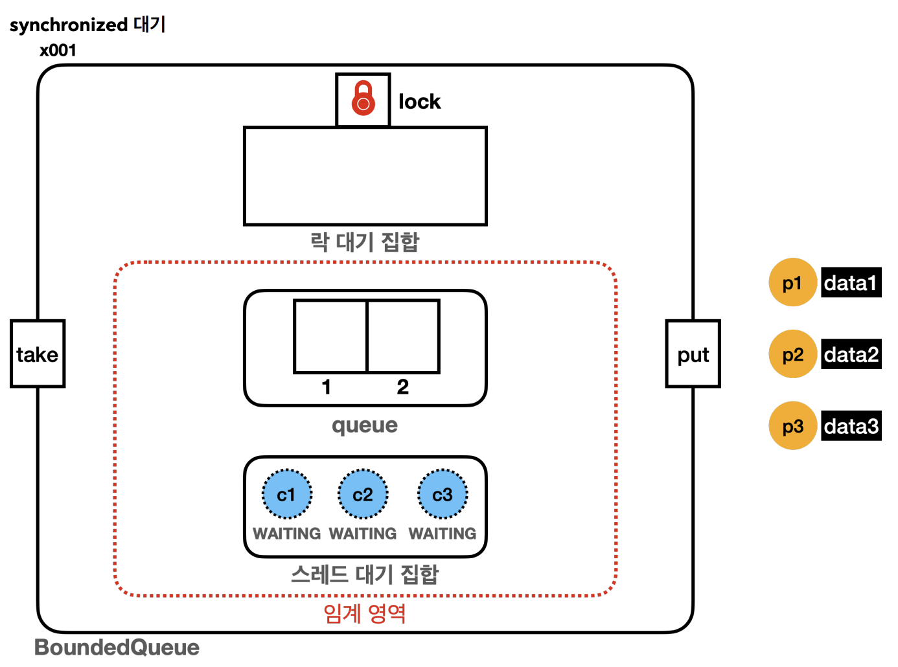
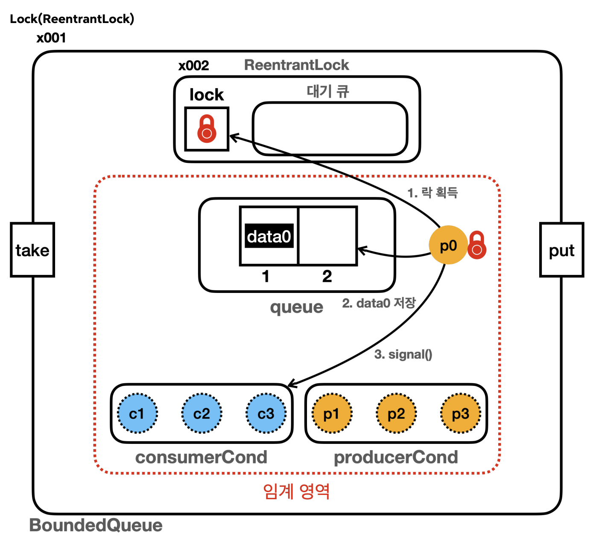

---

# 6. 분산락(Distribution Lock)

- `synchronized`나 `Lock` 인터페이스, 동시성 컬렉션 등은 한 JVM 내에서 여러 스레드에 대한 동시성을 다루는 방법으로 여러 JVM에서는 적용되지 않음. 여러 서버에서 공유된 데이터를 제어하기 위한 기술이 분산락. Redis, MySQL, Zookeeper 등을 통해 구현 가능.

---

# Ref

- 인프런 김영한의 실전 자바 - 고급 1편, 멀티스레드와 동시성 섹션 1 ~ 10
- https://docs.oracle.com/en/java/javase/21/docs/api/java.base/java/util/concurrent/locks/ReentrantLock.html
- https://stackoverflow.com/questions/11999324/whats-a-distributed-lock-and-why-use-it
- https://helloworld.kurly.com/blog/distributed-redisson-lock/#2-redis%EC%9D%98-redisson-%EB%9D%BC%EC%9D%B4%EB%B8%8C%EB%9F%AC%EB%A6%AC-%EC%84%A0%EC%A0%95-%EC%9D%B4%EC%9C%A0
- https://d2.naver.com/helloworld/294797
