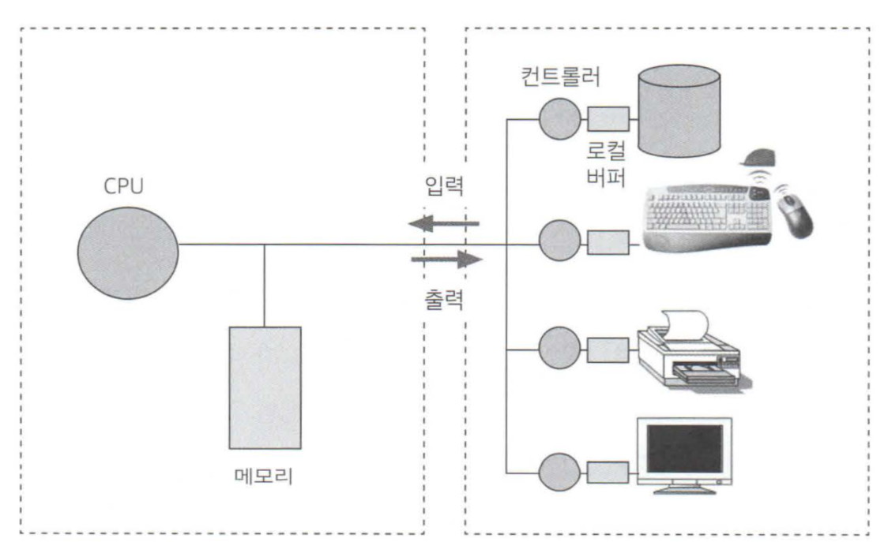
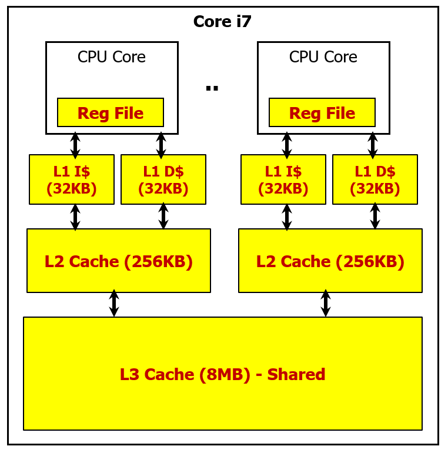
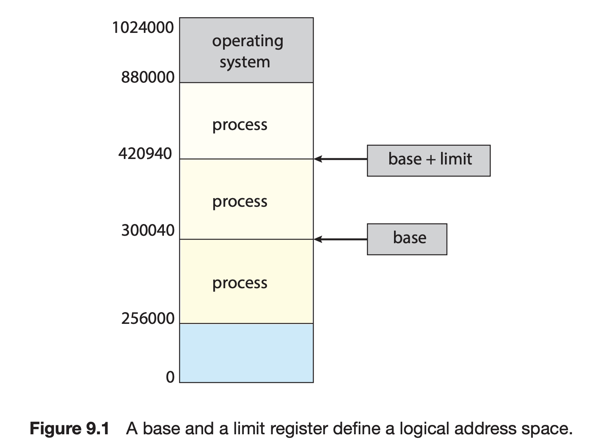
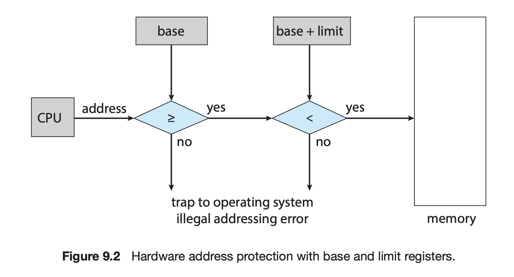
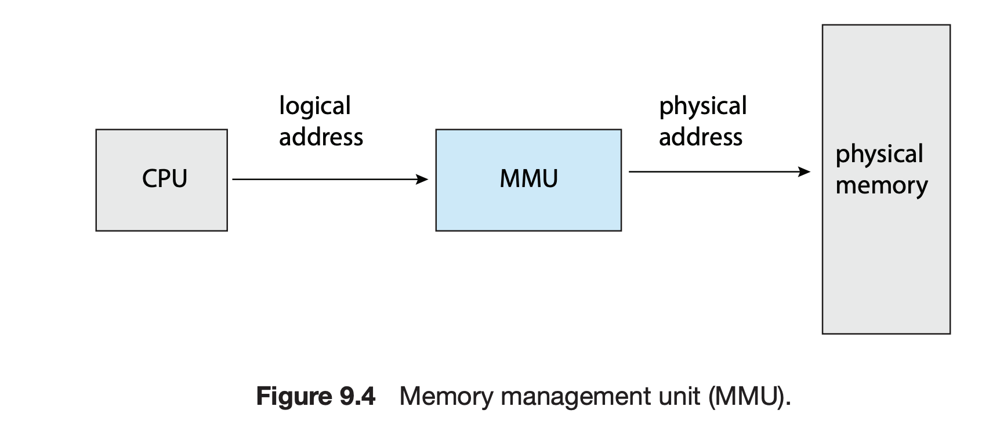
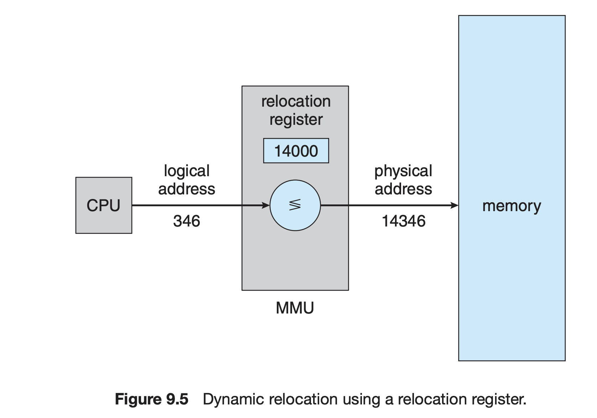
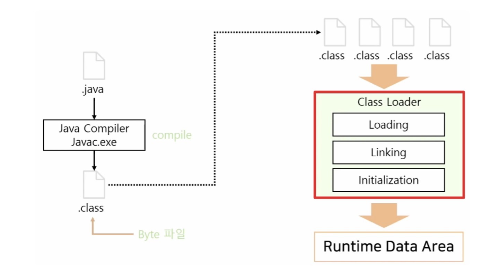

# 메인 메모리 배경

## 메인 메모리(Main Memory)

- CPU가 직접 접근할 수 있는 범용 저장장치
- 컴퓨터 외부인 보조 기억장치에 저장된 데이터에 CPU가 접근하려면 먼저 보조 기억장치에서 메인 메모리로 이동시켜야 함
- 메인 메모리는 보조 기억장치에 비해 일반적으로 훨씬 빠르지만 CPU의 레지스터에 비하면 훨씬 느리므로 중간에 캐시 메모리(L1, L2, L3)를 두어 속도 완충(CPU마다 약간 다름)

- 속도는 레지스터 > L1 캐시 > L2 캐시 > L3 캐시 순서이며 크기는 반대
- L1, L2 캐시는 코어당 할당된 캐시이며, L3 캐시는 보통 코어간 공유 가능한 캐시

---

## 기준 레지스터(Base Register) & 상한 레지스터(Limit Register)

각각의 사용자 프로세스와 운영체제 영역을 서로 보호해서 시스템이 올바르게 동작하게 하려면 서로 독립된 메모리 공간을 갖도록 해야한다. 이를 위해 각 프로세스별로 접근 가능한 메모리 주소 영역을 설정하고 해당 영역에만 접근하도록 해야한다.

- 기준 레지스터는 가장 작은 합법적인 메모리 주소의 값을 저장한다.
- 상한 레지스터는 합법적인 메모리 영역의 크기를 저장한다.

ex) 기준 레지스터의 값이 300040, 상한 레지스터의 값이 120900이면 프로세스의 합법적 메모리 주소 영역은 300040 ~ 420940(300040 + 120900)

기준 레지스터와 상한 레지스터는 커널 모드에서만 적재되며, 유저 모드로 수행되는 프로그램이 합법적이지 않은 메모리 주소 영역에 접근하면 OS는 트랩(trap)을 발생시킨다.

---

## 메모리 관리 장치(MMU, Memory Management Unit)

CPU가 생성하는 주소인 논리 주소(Logical Address)와 메모리가 취급하는 주소인 물리 주소(Physical Address)를 변환해주는 하드웨어 장치

MMU의 주소 변환은 여러가지 방법이 있는데 아주 단순한 예시로 CPU의 논리 주소를 MMU의 재배치 레지스터(Relocation Register)를 통해 아래와 같이 물리 주소로 변환

---

## 동적 로딩(Dynamic Loading)

프로세스가 실행되기 위해서 프로세스 전체를 메모리에 적재한다면 프로세스의 크기가 메모리의 크기보다 클 경우 적재가 불가능하다. 메모리 공간을 더 효율적으로 이용하기 위해 동적 로딩을 해야하는데 동적 로딩은 필요한 경우에만 적재를 하는 방식이다. 반면 정적 로딩(Static Loading)은 프로그램을 실행하는 순간 모든 실행 파일을 메모리에 적재하는 방식이다.

자바의 경우 클래스 로더(Class Loader)가 동적 로딩을 통해 애플리케이션에서 필요한 경우(ex - new 키워드) 메모리에 적재한다. JVM에서 더 이상 사용되지 않는 클래스는 언로딩되며 GC에 의해 이루어진다.

가상 메모리랑 개념이 비슷한듯 아닌듯해서 찾아봤는데 동적 로딩은 소프트웨어적인 관점, 가상 메모리는 OS적인 관점으로 보는 것 같음

---
