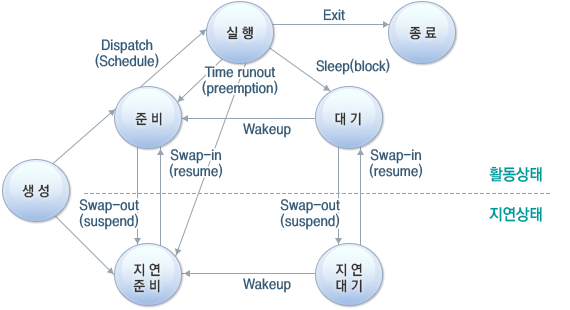
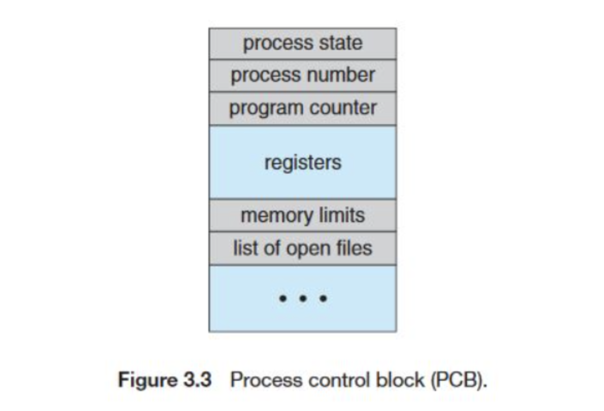
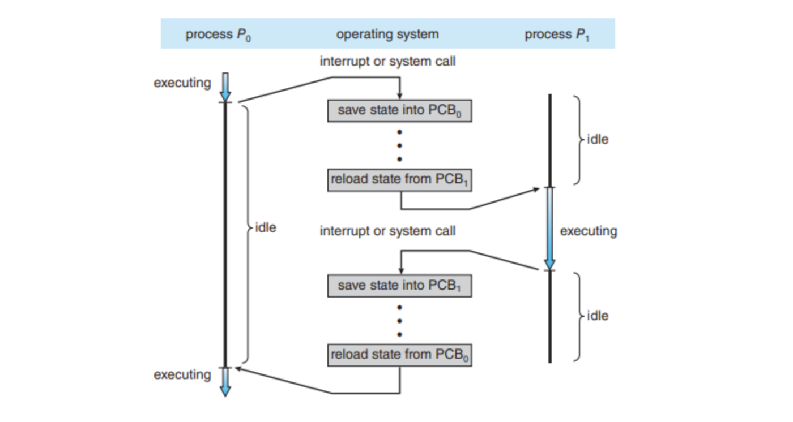

# Deep Dive

Deep Dive into Operating System

---

## Contents

* [프로세스 상태 다이어그램](#프로세스-상태-다이어그램)
* [프로세스 상태의 분류](#프로세스-상태의-분류)
* [스케줄러와 전이](#스케줄러와-전이)
* [Swap-Out (Suspend)과 Swap-In (Resume)이 일어나는 시점](#swap-out-suspend과-swap-in-resume이-일어나는-시점)
* [지연 상태와 중간 스케줄링](#지연-상태와-중간-스케줄링)
* [내부적 동작](#내부적-동작)

---

### 프로세스 상태 다이어그램

전통적인 운영체제에서 프로세스가 거치는 **모든 상태 전이**에 대한 다이어그램입니다.

* **윗부분**(활성 상태)은 CPU 스케줄러의 즉시 대상이 될 수 있는 상태들이며,
* **아랫부분**(비활성 상태)은 메모리에서 내려가 디스크(스왑 영역)에 보관되는 상태들입니다.

### 프로세스 상태의 분류

운영체제 관점에서 프로세스 상태는 크게 **활성(Resident)** 상태와 **비활성(Non-Resident)** 상태로 나눌 수 있습니다.

1. **활성 상태 (Resident States)**

   * **준비(Ready)**
     CPU 할당만을 기다리는 상태입니다. 프로세스의 주소 공간(code, data, stack)과 PCB(Process Control Block)가 메모리에 상주하며, 스케줄러가 언제든지 Dispatch할 수 있게 됩니다.
   * **실행(Running)**
     실제 CPU 레지스터에 맵핑되어 명령어를 수행 중인 상태입니다. 타이머 인터럽트 또는 I/O 요청으로 곧 빠져나올 수 있습니다.
   * **대기(Waiting / Blocked)**
     I/O 완료나 특정 이벤트(예: 입출력, 동기화 오브젝트 신호)를 기다리며 CPU 사용권을 자발적으로 반납한 상태입니다. 이벤트가 발생하면 준비 상태로 돌아갑니다.

2. **비활성 상태 (Non-Resident States)**

   * **지연준비(Suspended-Ready)**
     준비 상태에 있던 프로세스를 메모리 부족·다중 프로그래밍 정도 조절 목적으로 디스크로 스와핑한 상태입니다.
   * **지연대기(Suspended-Blocked)**
     대기 상태에 있던 프로세스를 스와핑 아웃한 경우입니다. I/O 완료 인터럽트가 발생해도 즉시 활성화되지 않고, 먼저 메모리로 복귀되어야 합니다.
   * **종료(Terminated)**
     `exit()` 호출 또는 치명적 오류로 프로세스 생명 주기가 끝난 상태입니다. PCB가 소멸되고 프로세스 자원이 회수됩니다.

### 스케줄러와 전이

활성 상태에서 프로세스가 어떻게 이동하는지 살펴보겠습니다.

1. **Dispatch (Schedule)**

   * 준비 큐(Ready Queue)에서 다음 실행할 프로세스를 선택하여 CPU에 배치합니다.
   * PCB에 저장된 레지스터 값과 프로그램 카운터(PC)를 복원하고 문맥 교환(Context Switch)이 일어나게 됩니다.

2. **Time-Out (Preemption)**

   * 타이머 인터럽트가 도달하면 현재 실행 중이던 프로세스를 다시 준비 상태로 전이합니다.
   * Round-Robin, Priority with Time-Slice 등 선점형 스케줄링 기법이 적용됩니다.

3. **Sleep / Block**

   * 프로세스가 디스크 I/O, `sleep()` 호출, 동기화 오브젝트 대기 등으로 자발적으로 CPU를 반납합니다.
   * 이때 프로세스는 대기 큐(Blocked Queue)에 삽입되고, CPU는 다른 프로세스로 넘어갑니다.

4. **Wakeup**

   * I/O 완료 인터럽트나 다른 프로세스의 signal/notify가 발생하면, 해당 프로세스는 대기 큐에서 꺼내져 준비 큐로 전이됩니다.
   * 다음 Dispatch 대상이 될 준비가 완료됩니다.

5. **Exit**

   * `exit()`, 예외 발생, `kill()` 신호 등으로 프로세스가 종료됩니다.
   * 종료된 프로세스는 시스템 콜을 통해 자원 해제 후 PCB가 제거되며, 부모 프로세스에게 종료 상태가 통보됩니다.

### 지연 상태와 중간 스케줄링

메모리 관리 차원에서 **중기 스케줄러(Medium-term Scheduler)** 가 개입하여, 시스템의 다중 프로그래밍 정도를 조절하게 됩니다.

* **Swap-Out (Suspend)**
  * 활성 상태(준비 또는 대기)에 있는 프로세스를 디스크의 스왑 영역으로 옮겨 비활성화합니다.
  * 메모리 사용량을 줄여, 새로운 프로세스 진입 또는 캐시 페이지 확보에 여유를 만듭니다.

* **Swap-In (Resume)**

  * 디스크에 보관된 지연 상태 프로세스를 다시 메모리로 불러옵니다.
  * 원래 대기 상태였던 프로세스는 대기 큐에, 준비 상태였던 프로세스는 준비 큐에 복귀합니다.

이를 통해 시스템은 **메모리에 상주할 프로세스 수**를 조정하며 과도한 스래싱(thrashing) 위험을 낮추게 됩니다.

### Swap-Out (Suspend)과 Swap-In (Resume)이 일어나는 시점

#### 1. Swap-Out (Suspend)이 발생하는 경우

1. **메모리 압박(memory pressure) 상황**

   * 시스템의 **유휴 물리 메모리**가 낮은 임계치(lo-watermark) 아래로 떨어질 때
   * 중기 스케줄러(또는 Linux의 `kswapd` 데몬)가 활성화되어, 메모리 사용량을 낮추기 위해 일부 프로세스를 디스크로 옮깁니다.

> Watermark
메모리 존(zone)마다 정의된 임계치로 lo-watermark 아래로 내려가면 즉시 페이지 회수를 트리거하게 되고 high-watermark는 페이지 회수를 마친 뒤 반드시 확보해야 할 여유 메모리 목표치입니다.

> kswapd
“kernel swap daemon”의 약자로,프리 메모리가 lo-watermark 이하로 떨어지면 깨워져 동작하며 LRU 페이지를 회수, 스왑 아웃해 high-watermark까지 메모리를 복구하는 백그라운드 커널 스레드입니다.

2. **장시간 Block 또는 Sleep 상태**

   * 프로세스가 I/O 대기, `sleep()` 호출, 락(lock) 획득 대기 등으로 **장시간 CPU를 사용하지 않을 때**
   * 메모리에 머무르는 것이 비효율적이라 판단되면, 준비(Ready)·대기(Blocked) 상태 프로세스 중 우선순위가 낮거나 오래 기다린 대상을 스왑 아웃합니다.

3. **다중 프로그래밍 정도(Degree of Multiprogramming) 조절**

   * 한꺼번에 너무 많은 프로세스가 메모리에 올라와 스래싱(thrashing)이 우려될 때
   * 시스템 전체 처리량(throughput)을 높이기 위해, 일부 프로세스를 비활성화하여 활성 프로세스 수를 제한합니다.

#### 2. Swap-In (Resume)이 발생하는 경우

1. **프로세스 Wakeup 요청 시**

   * Block 상태였던 프로세스가 I/O 완료 인터럽트나 `signal/notify`를 통해 **다시 실행 준비**가 될 때
   * 디스크에 스왑 아웃된 프로세스가 있다면, 우선적으로 메모리로 복귀시켜 준비 큐(Ready Queue)에 넣습니다.

2. **메모리 여유(free memory) 확보 시**

   * 물리 메모리가 **high-watermark** 이상으로 회복되면
   * `kswapd` 또는 중기 스케줄러가 디스크에 있던 프로세스를 메모리로 불러와,

     * 이전에 준비 상태였던 프로세스는 **준비 큐**로
     * 이전에 대기 상태였던 프로세스는 **대기 큐**로
       복귀시킵니다.

3. **프로세스 우선순위 상승 또는 수동 Resume 요청**

   * 관리자가 `resume` 명령을 내려 특정 스왑 아웃 프로세스를 즉시 메모리에 복구할 수도 있습니다.
   * 이 경우에도 메모리 여유가 전제되어야 하기 때문에, 필요 시 추가 스왑-아웃이 선행될 수 있습니다.

### 내부적 동작

프로세스 상태 전이를 가능케 하는 OS 내부 구조를 살펴보겠습니다.
1. **PCB (Process Control Block)**

   * 프로세스 식별자(PID), 상태, 레지스터 저장값, 스케줄링 우선순위, 메모리 맵, I/O 정보 등을 포함합니다.
   * 상태 전이 시마다 해당 PCB가 적절한 큐(준비 큐, 대기 큐, 스왑 큐)로 이동하게 됩니다.

2. **문맥 교환(Context Switch)**

   * CPU 레지스터 집합, 프로그램 카운터, 스택 포인터 등을 저장 → 복원 과정을 거칩니다.
   * 일반적으로 수 마이크로초에서 수 밀리초 오버헤드가 발생하며, 빈번한 문맥 교환은 시스템 성능 저하로 이어집니다.

3. **인터럽트 및 예외 처리**

   * **타이머 인터럽트**: 선점형 스케줄링 구현의 핵심입니다.
   * **I/O 인터럽트**: 디바이스 드라이버가 완료 신호를 OS에 전달하여 대기 중인 프로세스를 깨웁니다.
   * **페이지 폴트(Page Fault)**: 가상 메모리 환경에서 발생하며, 해당 페이지를 디스크에서 메모리로 로드한 뒤 준비 상태로 전이됩니다.

4. **스케줄링 알고리즘**

   * **FCFS**, **SJF**, **Priority**, **RR**, **Multilevel Queue** 등 다양한 기법이 존재합니다.
   * 각 기법은 **응답 시간**, **처리량(throughput)**, **공정성(fairness)**, **오버헤드** 측면에서 트레이드오프를 가집니다.

