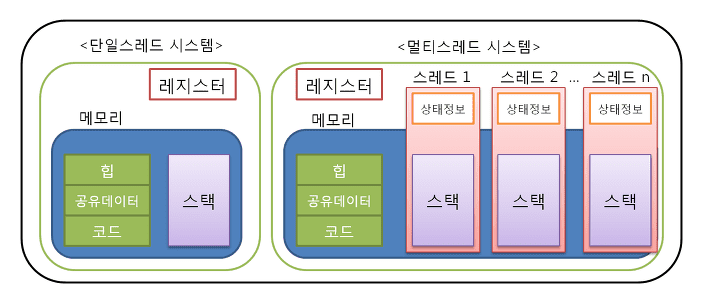
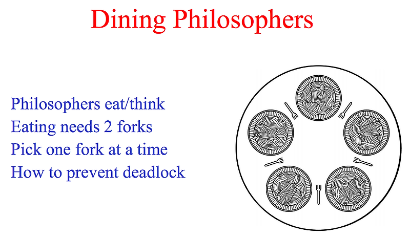
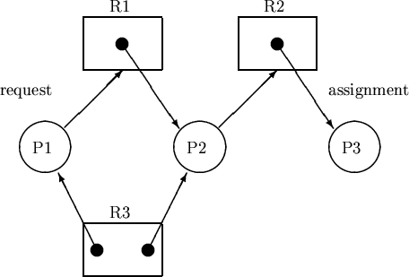
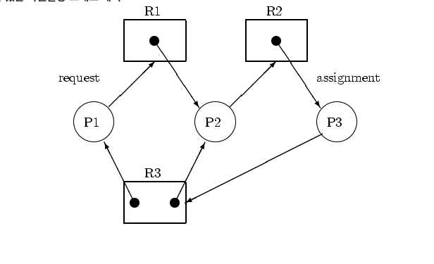
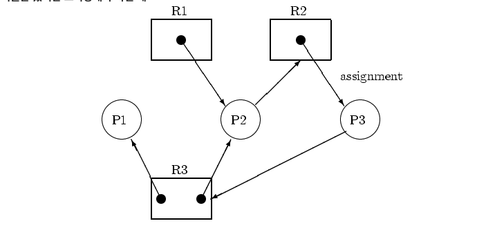

# Deep Dive

Deep Dive into Operating System

---

## Contents
- [멀티 쓰레드 환경](#멀티-쓰레드-환경)
- [데드락(식사하는 철학자 문제)](#데드락)
- [데드락의 특징](#데드락의-특징)
- [자원 할당 그래프](#자원-할당-그래프)
- [데드락 처리 방법 (교착상태 회피)](#데드락-처리-방법교착상태-회피)
- [데드락 처리 방법 (교착상태 예방)](#데드락-처리-방법교착상태-예방)
- [Thread Safe란?](#thread-safe란)
---
### 멀티 쓰레드 환경

하나의 Java 어플리케이션이 돌고있다고 가정했을때 한명이 아닌 여러 명이 접근할 때 또는 한명이 여러 가지의 task를 병렬로 처리해야할 때를 통틀어 멀티 쓰레드 환경이라고 합니다. 하지만 쓰레드는 무한정 생성해서 사용할 수 없기 떄문에 사용 가능한 유휴 쓰레드와 사용중인 활성 쓰레드의 개념으로 분류할 수 있습니다. 따라서 운영체제는 유휴 쓰레드를 최적화 시켜 과도한 자원의 낭비를 막고 시스템의 오버헤드를 방지해야만 합니다. 

이 과정에서 하나의 프로세스 내에서 스택 영역을 제외한 데이터, 힙 영역을 공유하여 사용하기 떄문에 여러 스레드가 동시에 같은 변수나 자료구조에 접근하면 **경쟁 상태(race condition), 데이터 손상**이 발생할 수 있습니다.

이를 위해 운영체제는 공유 자원에 대한 읽기·쓰기 동기화를 위해 뮤텍스(Mutex), 세마포어(Semaphore), 스핀락(SpinLock) 같은 락 메커니즘을 사용합니다.

하지만 이떄 동기화를 잘못 설계하게 되면 모든 유휴 쓰레드가 공유 자원에 대한 접근 자체가 불가능한 **교착상태(Dead Lock)** 이 발생하게 됩니다.

### 데드락(식사하는 철학자 문제)

데드락을 설명하는 가장 대표적인 예시 식사하는 철학자 문제를 들여다보겠습니다. 
1. 상황
- 원탁에 다섯 명의 철학자가 앉아 있고, 각자 앞에는 스파게티 접시가 하나씩 있습니다.

- 접시 사이사이에는 포크가 놓여 있는데 철학자 N명일 때 포크도 N개입니다.

- 식사를 하려면 양쪽에 있는 두 개의 포크가 모두 필요하고 생각할 때는 포크를 내려놓습니다.
2. 규칙 

- 철학자는 생각 → 배고픔 → 포크를 한 개씩 집음 → 식사 → 포크 내려놓기 → 생각 순으로 행동을 반복합니다.

- 포크는 한 번에 하나의 철학자만 사용할 수 있습니다(상호 배제)

3. 데드락 발생 시나리오

- 모든 철학자가 동시에 배고파져서 같은 순간에 왼쪽 포크를 먼저 집는다고 가정해 보겠습니다.

- 그러면 각자 왼쪽 포크만 집은 상태에서 오른쪽 포크가 필요하다며기다리게 됩니다.

- 하지만 오른쪽 포크를 가진 철학자는 없으니 모두가 영원히 기다리게 되고 결국 누구도 포크를 들지 않는 교착상태가 발생합니다.

마지막에 따라서 모든 철학자가 먹고싶은 상태인데도 포크를 들 수 없는 상황이 오게 됩니다.

### 데드락의 특징
위에 식사하는 철학자 문제를 예시를 통해서 데드락의 특징을 4가지 뽑아낼 수 있을 것 같습니다. 아래는 실제로 데드락이 발생할 수 있는 네가지 필요조건입니다.
1. 상호 배제(mutual exclusion)
한 번에 한 쓰레드만이 공유 자원을 사용할 수 있고 다른 쓰레드가 공유자원을 요청하면 요청 쓰레드는 자원이 방출될 때까지 반드시 지연됩니다.
2. 점유 대기 원칙(hold & wait)
쓰레드는 최소한 하나의 자원을 점유한 채 현재 다른 스레드에 의해 점유된 자원을 추가로 얻기 위해서 반드시 대기해야합니다.
3. 비선점(non preemption)
운영체제가 자원을 강제로 뺏을 수 없고 점유하고있는 쓰레드가 task를 종료한 후에 자발적으로 마쳐야만 합니다.
4. 순환 대기 원칙(circular wait)
대기하고있는 쓰레드의 집합이 연쇄적으로 자원을 기다리며 대기하는 원칙입니다.

### 자원 할당 그래프
그렇다면 위에서 얘기했던 공유자원이란 무엇이고 데드락이 발생하는 상황을 그림으로 살펴보겠습니다.

#### 자원할당 그래프의 구성 요소

- 쓰레드 노드(Thread Node): (P1, P2, P3…)  
여기서 P1·P2·P3는 실행되고 있는 쓰레드를 의미합니다.  
- 자원 노드(Resource Node): 
여기서 직사각형 노드(R1, R2, R3…)은 공유 자원을 의미하고 직사각형 노드 안에 점은 해당 자원의 인스턴수의 수를 의미합니다.
- 요청 간선(Request Edge): 
쓰레드 → 자원을 요청하고 있는 상태입니다. 
- 할당 간선(Assignment Edge)
자원 → 쓰레드에서 할당 하고있는 것을 의미합니다.

#### 사이클이 있어 데드락이 발생하는 경우

위에 그림은
- 각 자원(R1, R2, R3)의 인스턴스 수가 1개뿐이라서  
- P1 → R1 → P2 → R2 → P3 → R3 → P1 형태로 사이클 즉 순환 대기가 형성됩니다.  
- 따라서 어느 누구도 다음 자원을 얻지 못하므로 서로 무한 대기에 빠져 **데드락**이 발생합니다.

#### 사이클이 있지만 데드락이 발생하지 않는 경우 
반면 위에 그림에서는

- R3 인스턴스가 2개여서 여유 자원이 하나 더 있습니다.  
- 사이클은 존재하지만 여분의 R3를 이용해 어느 한 쓰레드가 먼저 자원을 할당받고 완료 후 자원을 반납할 수 있습니다.  
- 이로 인해 나머지 쓰레드들도 차례로 진행 가능하여 데드락이 발생하지 않습니다.

### 데드락 처리 방법(교착상태 회피)

교착상태 회피(Deadlock Avoidance)는 시스템이 안전 상태(safe state)를 유지하도록 동적으로 자원 할당을 결정하는 기법입니다. 대표적인 알고리즘으로 뱅커스 알고리즘(Banker’s Algorithm)이 있습니다.

1. 안전 상태(Safe State) 검사

- 현재 할당 상태에서 모든 쓰레드가 순차적으로 필요 자원을 모두 얻고 실행을 완료한 뒤 자원을 반납할 수 있는 상태입니다. 즉, 어떤 순서로든 잔여 자원을 충분히 나눠주어 모든 쓰레드가 끝날 수 있으면 안전 상태라고 부를 수 있습니다.

2. Banker's Algorithm
교창 상태를 회피할 수 있는 방법 중 가장 유명한 알고리즘인 Banker's Algorithm을 쉽게 설명해보면

은행원이 고객(쓰레드)에게 돈(자원)을 빌려줄 때 이 대출을 해 줬을 때 결국 모두가 돈을 다 갚고 안전하게 끝낼 수 있는 지 미리 확인해 보는 방식이라고 생각할 수 있습니다.

1. 고객의 대출 요청

   * 프로세스 $P_i$가 추가 자원 $R_j$을 빌려 달라고 요청합니다.

2. 일단 빌려준다고 가정하기

   * 은행 시스템은 실제로 돈을 주기 전에, 만약 내가 이만큼을 빌려준다면이라는 가정 하에

     * 남아 있는 돈(잔액, Work)을 줄이고
     * 고객이 앞으로 필요로 할 최대금액(Need) 테이블도 갱신합니다.

3. 안전하게 모두 갚을 수 있는지 미리 시뮬레이션

   * 모든 고객을 (Finish\[i] = false)로 표시하고 시작합니다.
   * 남은 돈(Work)으로 “최대 필요금액(Need)이 현재 잔액 이하인” 손님을 찾아서

     * 이 손님이 빌린 만큼 다 쓰고 돌려준다면이라고 가정하고
     * 잔액 Work에 그 손님의 이미 받은 대출금액(Allocation\[i])을 다시 더해줍니다.
     * 그리고 Finish\[i]를 true(갚았음)로 표시합니다.
   * 이 과정을 반복해서 모두 Finish\[i]가 true가 되면, 안전 상태를 기록합니다.

4. 결정 내리기

   * 안전 상태라면 자원을 빌려줍니다.
   * 안전하지 않다면 대출을 거절하거나 기다리게 해서, 교착 가능성을 막습니다.

하지만 위의 Banker's Algorithm은 자원 할당 시 마다 검사해야해서 오버헤드가 발생할 가능성이 매우 높고 프로세스의 최대 사용량을 미리 알고있어야 하기때문에 실제로 사용하기엔 한계점이 명확합니다.

### 데드락 처리 방법(교착상태 예방)

교착상태 예방(Deadlock Prevention)은 교착이 발생하기 위한 네 가지 필요조건 중 하나 이상을 사전에 제거하여 교착 자체를 방지하는 전략입니다. 대표적인 기법은 다음과 같습니다.

1. 상호 배제 조건 제거
* 대부분의 자원은 공유 불가이므로 현실적으로 완전 제거 불가합니다.
* 대신 읽기 전용 자원(Read-only)은 공유 가능하도록 설계하는 것이 좋습니다.

2. 점유 대기 조건 제거

* 프로세스가 자원을 얻기 전에는 반드시 모든 필요한 자원을 한꺼번에 신청하게 함

 * 예: Pi가 R1, R2가 필요하면 한 번에 요청
* 부족 시 아무 자원도 할당하지 않으므로 Hold & Wait 불발됩니다.

3. 비선점 조건 제거

* 이미 할당된 자원을 다른 프로세스가 선점할 수 있게 허용할 수 있게 합니다.

 * 예: 우선순위 반전 해결 기법처럼 강제 회수 후 나중에 재할당하여 프로세스가 필요 자원을 독점하지 못하게 합니다.

4. 순환 대기 조건 제거
* 자원에 순서(ordering)를 부여하고 높은 순서의 자원만 요청하도록 제한하는 방법입니다.모든 프로세스는 자원 번호가 큰 순서로만 점유하여 순환 대기가 불가능하도록 자원 요청 방향을 일관되게 설계하는 방법입니다.

### Thread Safe란?

Thread Safe란 다중 스레드가 동시에 접근해도 의도한 대로 동작하며, 경쟁 상태(race condition)나 데이터 손상이 발생하지 않는 성질을 말합니다.

* 보장 대상: 메서드, 클래스, 라이브러리 단위로 “한 번에 여러 스레드가 호출해도 안전”

#### 주요 기법

1. 동기화(synchronization)

     * 뮤텍스(Mutex), 모니터(Monitor), synchronized 블록/메서드, ReentrantLock 등
     * 임계 구역(Critical Section)을 설정하여 한 번에 하나의 스레드만 진입할 수 있게하는 방법입니다.

2. 불변 객체(Immutable Objects)

     * 생성 후 내부 상태를 변경하지 않으므로 동기화 불필요합니다.
     * 예: `String`, Java의 `LocalDateTime`
3. 원자적(Atomic) 연산

     * 자바의 `AtomicInteger`, `AtomicReference` 등
     * CAS(Compare-And-Set) 기반으로 동기화 비용 최소화할 수 있습니다.
4. 스레드 로컬(Thread-Local) 저장소

     * 각 스레드가 독립적인 복사본을 사용하도록 분리하여 사용합니다.
     * `ThreadLocal<T>` 이용

